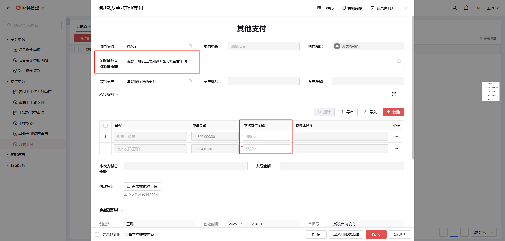

# 2. 支付申请

## 2.1 农民工工资支付申请

---

**说明**：
- 前提条件：农民工工资结算表审批完成
- 操作流程：
  1. 从关联表单导入（可选择多月份结算单）
  2. 对每个结算单填报：
     - 支付人数
     - 本次申请支付金额
  3. 上传支付申请清单附件（按班组分类）并 填报以往申报明细数据（用于金额核对）

**注意**：
- 标有红色`*`的字段为必填项

## 2.2 农民工工资支付

---

**说明**：
- 前提条件：农民工工资支付申请已审批完成
- 操作流程：
  1. 关联已审批的支付申请
  2. 系统自动筛选：
     - 当前单据下的结算单
     - 所选结算单下的工资表
  3. 填报：
     - 工资发放明细表中的本次支付金额
     - 选择农民工工资专户开户行
  4. 上传支付凭证
  5. 提交表单

## 2.3 工程款监管申请

---

**说明**：
- 前提条件：合同结算已审批完成
- 操作流程：
  1. 从关联表单导入（可选择多个合同结算单）
  2. 对每个结算单填报：
     - 开户行
     - 账号
     - 本次申请支付金额

**注意**：
- 标有红色`*`的字段为必填项

## 2.4 工程款支付

**说明**：
- 前提条件：工程款监管申请已审批完成

## 2.5 其他支出监管申请

**说明**：
- 适用于无合同的其他支出项目的监管申请

## 2.6 其他支付

**说明**：
- 前提条件：其他支出监管申请已审批完成
- 操作流程：
  1. 关联其他支出监管申请
  2. 系统自动显示：
     - 相关项目名称
     - 申请金额
  3. 手动输入本次实际支付金额

**作用**：
- 确保支付透明合规
- 记录支付细节便于审核跟踪