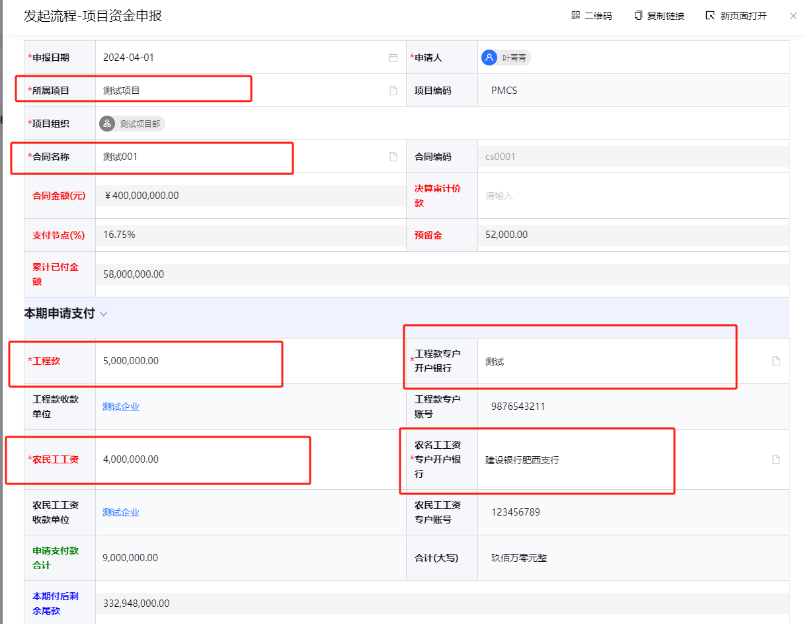
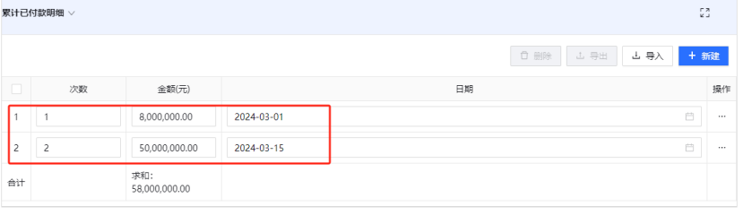

## 资金申报

### 1. 项目资金申报

说明：先在监管账户中增加农民工监管账户和工程款监管账户，项目资金申报含预付款、进度款、竣工结算等资金申报，款项到专户后，在项目资金拨款中填报实际到账金额；

注意:为规范项目资金申报流程，经中心批准，数管平台的线上项目资金申报和线下纸质申报同时进行,纸质送往中心时，线上流程必须发起,找相关负责人签字时，先审核线上流程，同时签署纸质的申报。。

点击“新增”按钮，选择所属项目--选择工程合同，填写本次申请工程款和农名工工资款项，填写以往的累计已付款明细(从关联表单导入，并删除第一行空行)，上传申请材料附件，提交。如图：

备注：在项目资金申报之前，请在“项目资金申报明细”增加以往的申请记录。

### 2. 项目资金申报明细
说明：自动计算工程款金额加农民工工资申报金额。

### 3. 项目资金拨款
路径：财务管理-资金申报-项目资金拨款

说明：项目款项到达监管专户后，及时在此表单填报各个监管专户的收款金额。
