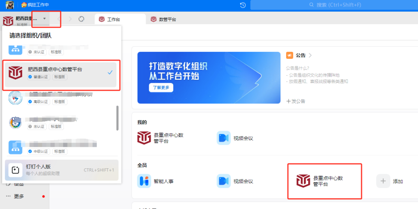
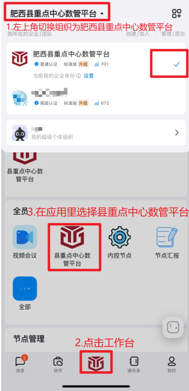

## 登录系统

### 1. 登录系统

#### 1.1. PC端登录方法:
(1) 在电脑浏览器中输入 www.fxzdsg.com，钉钉扫码登录；或者打开电脑钉钉登录，钉钉移动端扫码登录；确保当前组织为"肥西县重点中心数管平台"；在工作台中点击应用"县中心数管平台"跳转系统,如下图：

#### 1.2. 移动端登录方法:
在手机端打开钉钉；确保当前组织为"肥西县重点中心数管平台"；在工作台中点击应用"县中心数管平台"跳转系统，如下图：

备注：登录系统后，1、是由项目经理，把各方负责人加入系统，
2、编辑项目信息，项目部管理人员和八大员更新上去，后续所有流程都由“项目经理”审批。