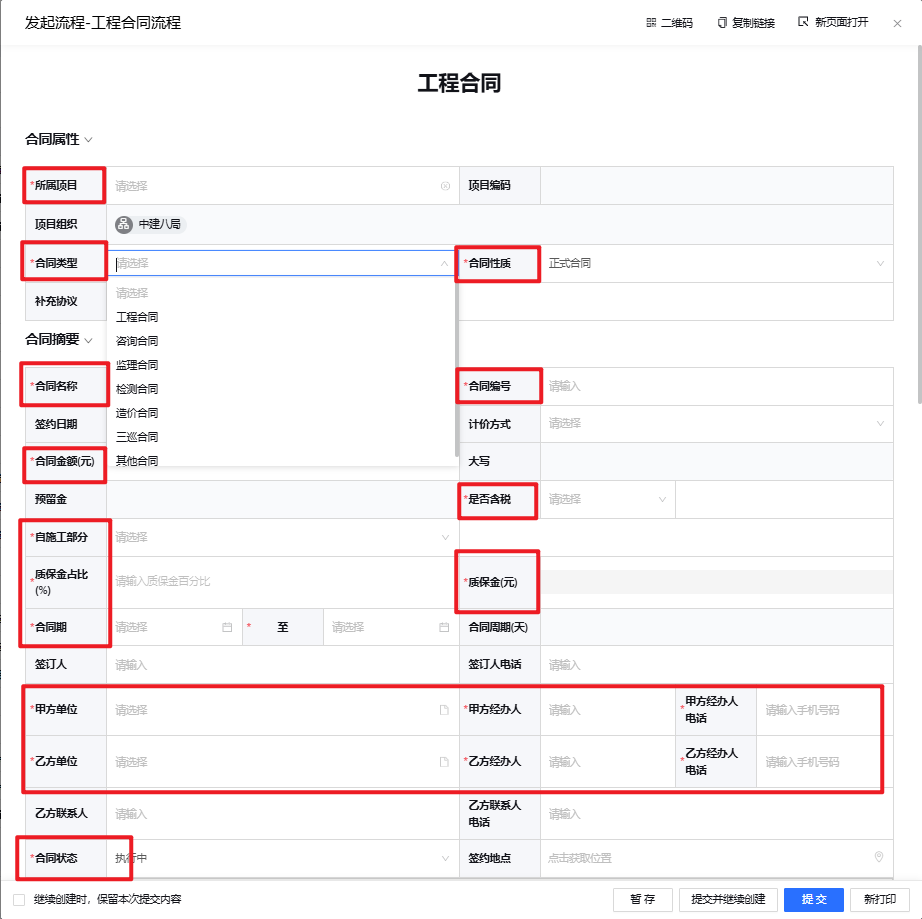
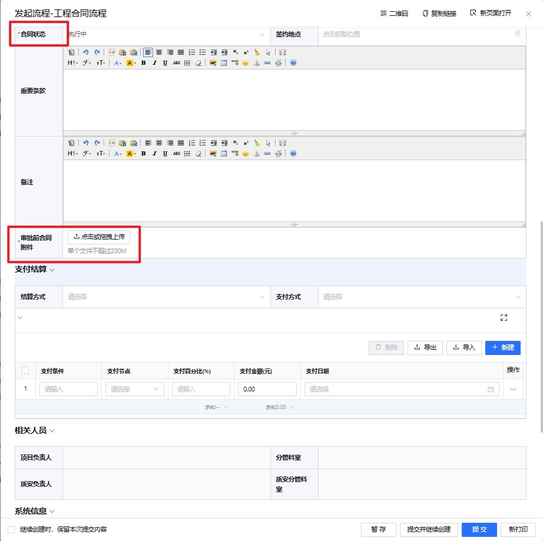

## 2. 工程合同（项目前期——>工程合同）

---

**说明**：  
- 红色`*`字段为必填项  
- **合同类型分类**：  
  1. 工程合同  
  2. 咨询合同  
  3. 监理合同  
  4. 检测合同  
  5. 造价合同  
  6. 三巡合同  
  7. 其他合同  
- **合同性质分类**：  
  - 正式合同  
  - 虚拟合同  
- **数据来源**：  
  - 甲乙方单位信息来源于往来单位，以统一社会信用代码为唯一标识  

**注意**：  
- 工程合同和支出合同为独立流程  
- 工程合同审批未完成时仍可录入支出合同信息  
- 支出合同仅关联参建单位和参建班组  