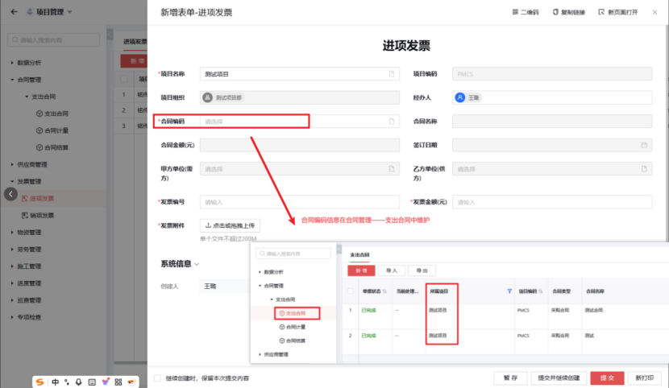

## 发票管理

说明：通过对发票信息的准确录入和核对，保证财务数据的真实性和完整性。

### 1. 进项发票

说明：进项发票是企业用于抵扣增值税和证明采购成本的重要财务凭证。
关联采购合同、租赁合同、专业分包合同、劳务分包合同、其他合同，用于企业准确核算成本和控制成本支出。

### 2. 销项发票

说明：销项发票是企业开具给购货方用以证明销售收入的合法凭证，同时也是购买方用于抵扣增值税的依据。

关联合同类型为工程合同、咨询合同、监理合同、检测合同、造价合同、三巡合同、其他合同，销项发票是企业销售商品或提供服务后向客户开具的发票，它是企业确认销售收入的重要依据。
