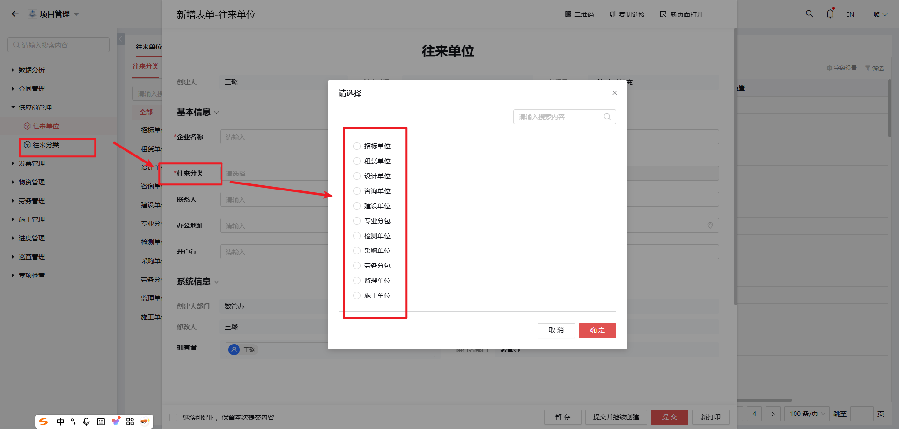

# 3.供应商管理

## 3.1 往来单位管理

### 功能说明
- 以**统一社会信用代码**作为唯一识别标识
- 严格禁止重复单位记录

### 操作流程
1. **单位查询**
   - 使用前需先查询单位是否存在

2. **单位维护**
   - 如单位不存在：执行新增操作
   - 如单位已存在：可直接选择使用

## 3.2 往来分类

### 功能说明
通过供应商分类实现：
- 制定个性化业务流程
- 建立分类管理规范
