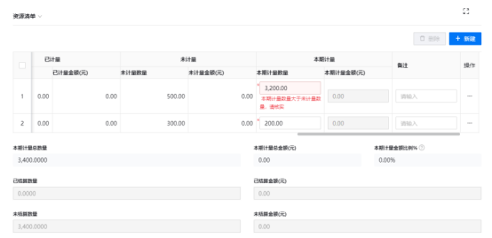
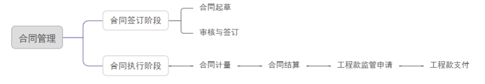

## 合同管理

### 1. 支出合同

#### 1.1. 支出合同

说明：支出合同属于合同管理范畴内的一种具体合同类型，它明确了项目中涉及资金支出的业务往来。填写合同属性、合同摘要、资源清单（关联资源表单可在物资管理目录下自定义配置，如下图）、累计结算支付（会根据资源清单自动生成）和付结算条件和方式。
“新增”按钮，在合同属性中：选择所属项目、合同类型等内容。在合同摘要中：填写相关信息，在资源清单中：填报资源明细和支付结算，最后上传合同附件。

#### 1.2. 合同计量

说明：合同计量是确定支出合同中约定工作完成量的过程。

第一步：选择所属项目。

第二步：选择支出合同(需要计量的支出合同)和计量日期，选择合同编码后，资源清单会自动带出支出合同的资源清单，请在资源清单表最后，输入“本期计量数量”并上传和供应商的计量结算单。

说明：本期计量数量不能大于未计量数量

#### 1.3. 合同结算

说明：合同结算是基于合同计量的结果来进行的。当完成合同规定的计量工作后，根据 “结算方式”，如按阶段结算或完工后一次性结算等，结合合同金额、已计量部分的金额等信息，计算出应结算的款项。

第一步：选择所属项目。

第二步：选择支出合同(需要结算金额的支出合同)。

第三步：在结算清单中，“从关联表单导入”导入已经计量的单据，并输入本期结算数量。

