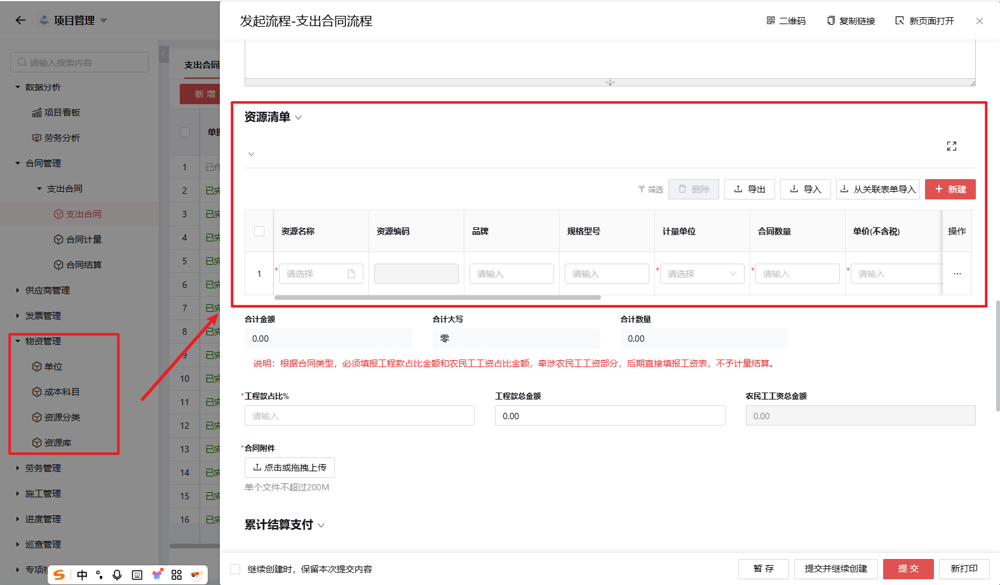
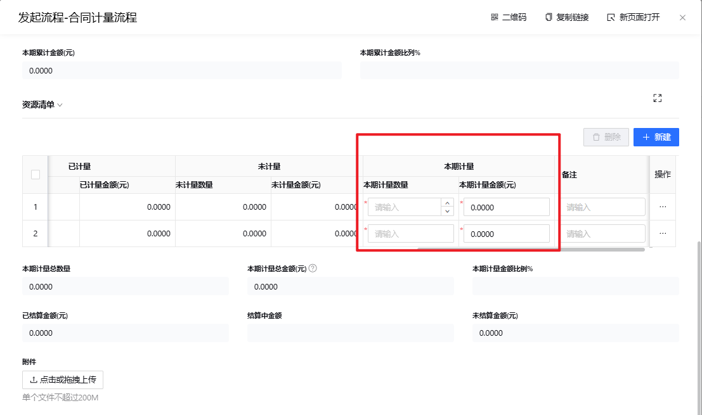
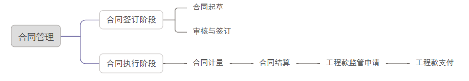

# 2.合同管理

## 2.1 支出合同

### 2.1.1 支出合同核心功能

#### 合同创建流程
1. **初始化操作**
   - 点击「新增」按钮触发创建流程
   - 必须选择所属项目（*红色标注为必填项*）

2. **合同类型配置**
   - 可选类型清单：
     - 采购合同
     - 租赁合同  
     - 专业分包合同
     - 劳务分包合同
     - 其他合同（自定义）

3. **合同性质定义**
   - 双选项配置：
     - 正式合同
     - 虚拟合同

#### 智能计算系统

---

1. **资源清单联动**
   - 数据来源：物资管理目录预配置数据
   - 自动计算功能：
     - 实时汇总资源清单合计金额
     - 根据工程款占比自动生成：
       - 工程款总金额
       - 农民工工资总金额（计算公式：`合同总金额 - 工程款金额`）

2. **附件管理**
   - 支持合同附件上传
   - 文件格式不限（建议PDF/扫描件）

#### 关键业务规则
- 合同摘要必须完整填写
- 带`*`的字段为系统强制校验项
- 金额计算逻辑不可手动覆盖（系统自动维护）

> 特别注意：农民工工资总额由系统自动计算得出。

## 2.2 合同计量

---

### 功能说明
合同计量是确定支出合同中约定工作完成量的过程

**前提条件**：支出合同已审批完成

### 操作流程
1. **选择项目**
   - 选择所属项目

2. **选择合同**
   - 选择需要计量的支出合同
   - 填写计量日期
   - 选择合同编码后，系统自动带出支出合同的资源清单

3. **填写计量数据**
   - 在资源清单表最后输入"本期计量数量"
   - 上传供应商的计量结算单

### 业务规则
- **计量数量限制**：本期计量数量不能大于未计量数量
- **数据自动关联**：选择合同编码后自动带出相关资源清单

## 2.3 合同结算

---

### 功能说明
合同结算是基于合同计量结果进行的款项计算流程，根据约定的结算方式确定应结算金额。

**前提条件**：合同计量已审批完成

### 操作流程
1. **选择项目**
   - 选择所属项目

2. **选择合同**
   - 选择需要结算的支出合同（需满足：结算金额已审批完成）

3. **结算操作**
   - 在结算清单中点击"从关联表单导入"
   - 导入已计量的单据
   - 输入本期结算数量

### 业务规则

---

- **结算范围限制**：
  - 仅可结算以下合同类型的工程款金额：
    - 采购合同
    - 租赁合同  
    - 专业分包合同
    - 其他合同
  - 农民工工资部分不予计量和结算

