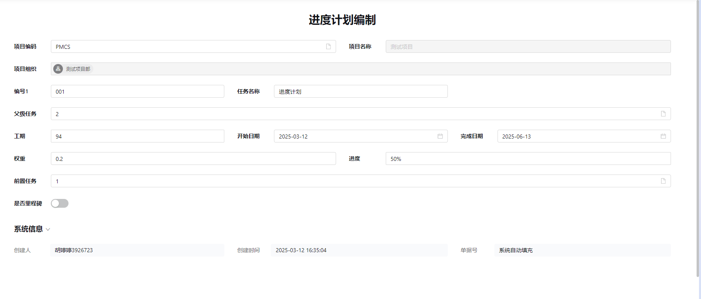
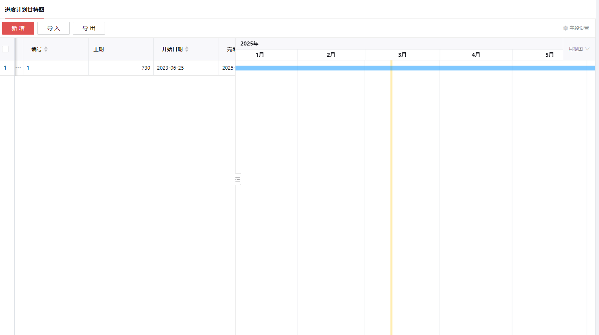

# 8.进度管理

## 8.1 进度计划编制

---

### 核心功能说明
进度计划编制是创建项目执行时间表的关键过程，主要包含以下元素：

#### 计划要素
1. **任务名称**  
   - 明确标识项目活动/工作包
   - 便于团队成员理解任务性质

2. **任务编号**  
   - 唯一标识符
   - 便于任务追踪和引用

3. **工期估算**  
   - 预测任务完成所需时间
   - 资源分配的基础依据

4. **日期设定**  
   - 开始日期：确定任务最早启动时间
   - 完成日期：设定任务最终期限

### 甘特图功能

---

#### 六大核心作用
1. **可视化展示**  
   - 图形化呈现项目时间线
   - 清晰展示任务关联关系

2. **进度规划**  
   - 辅助制定任务时间安排
   - 识别关键路径和里程碑

3. **进度监控**  
   - 对比计划与实际进度
   - 及时发现进度偏差

4. **团队沟通**  
   - 统一团队进度认知
   - 促进跨部门协调

5. **资源管理**  
   - 可视化资源分配情况
   - 优化资源使用效率

6. **计划调整**  
   - 支持动态进度调整
   - 应对项目变更和延误

### 管理要求
**重要提示**：项目开工后应及时编制施工进度计划并上传至数管平台

