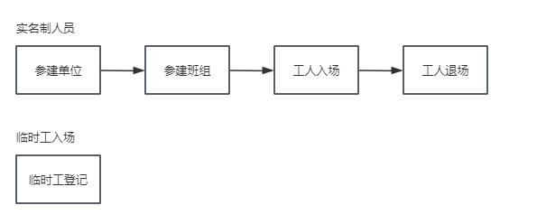
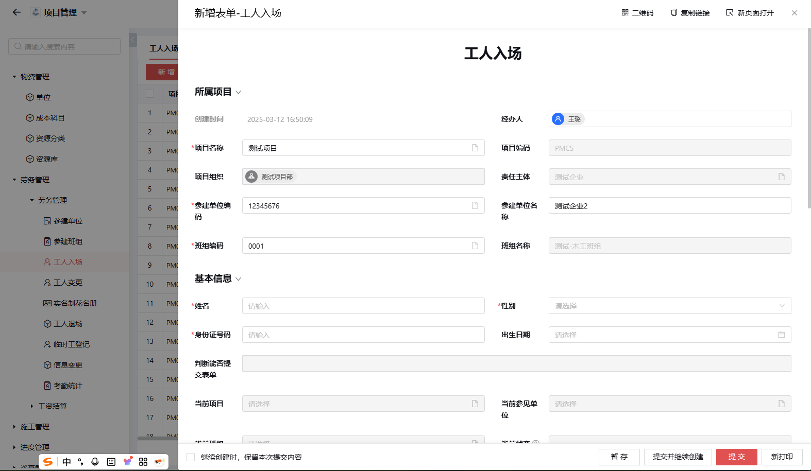
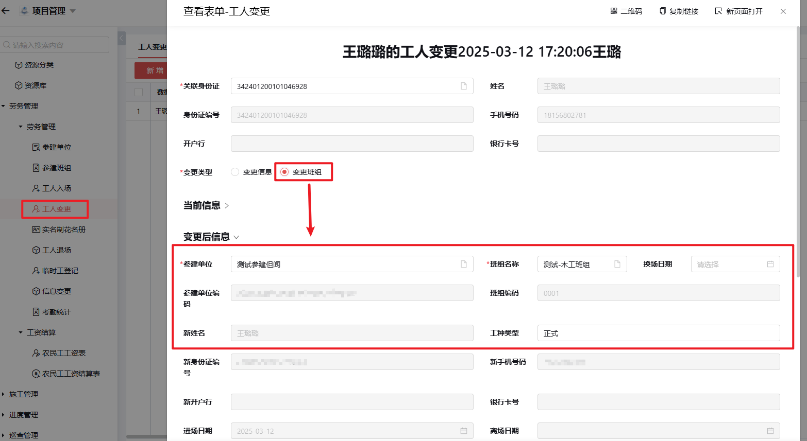
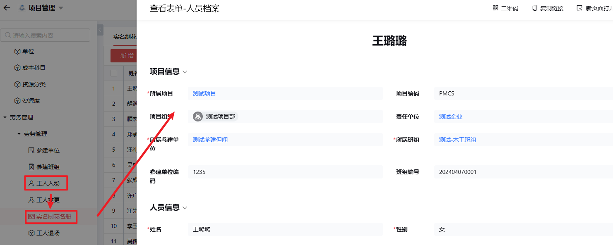
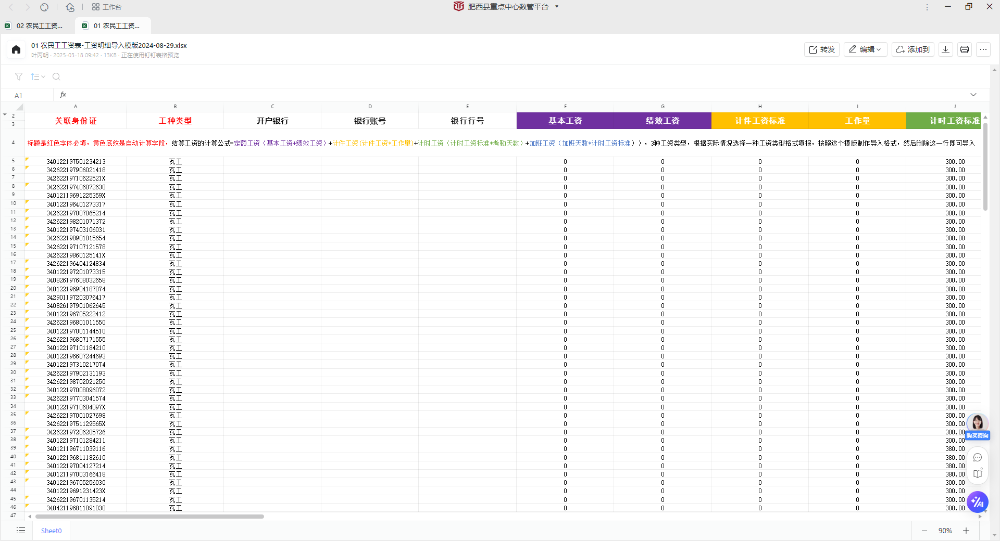
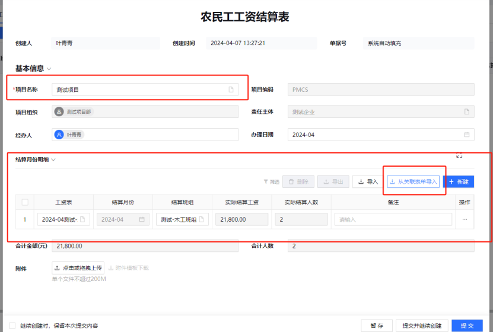

# 6.劳务管理

## 6.1 劳务管理

### 6.1.1 劳务管理流程图

---

### 6.1.2 参建单位管理
**功能说明**：
- 工程项目主要实施主体
- 负责劳务资源确定与班组合作建立

**业务规则**：
- 以统一社会信用代码为唯一标识
- 禁止重复记录
- 使用流程：
  1. 先查询系统中是否存在该单位
  2. 存在：直接使用
  3. 不存在：需新增

### 6.1.3 参建班组管理
**功能说明**：
- 由特定技能工人组成的施工团队
- 负责具体施工任务执行
- 工人与参建单位间的管理桥梁

**重要提示**：
- 必须关联分包合同（专业分包/劳务分包）

### 6.1.4 工人入场

---

**需填写信息**：
- 所属项目
- 基本信息（*红色字段为必填项*）

**需上传附件**：
- 身份证正反面
- 工资卡
- 劳动合同
- 进场承诺书

### 6.1.5 工人变更

---

**变更类型**：
1. 变更信息（修改基础信息）
2. 变更班组（修改班组信息）

### 6.1.6 实名制花名册

---

**功能特点**：
- 自动录入新入场工人数据
- 支持功能：
  - 新增/编辑/查找人员信息
  - 查看工作履历（蓝色字样可点击 & 退场重新入场数据会记录到这里）
  
**特殊说明**：
- 退场再入场以身份证号为唯一标识
- 状态编辑：
  - 正常
  - 已退场（不生成退场记录）

### 6.1.7 工人退场
**业务规则**：
- 需当月工资表填报完成后才能退场，如有特殊情况需要提前退场，必须要有考勤数据
- 修改档案状态不生成退场记录

### 6.1.8 临时工登记
**特点**：
- 独立记录，不关联花名册

### 6.1.9 信息变更

---

**功能优势**：
- 可同时修改：
  - 员工基础信息
  - 参建单位
  - 所属班组
- 支持批量编辑

### 6.1.10 考勤统计
**数据来源**：施工现场硬件设备，临时工考勤需手动录入

**重要规则**：无考勤记录无法提交工资表

## 6.2 工资结算

### 6.2.1 农民工工资表

---

**前置条件**：需先导入劳务基础数据（参建单位/班组/人员档案）

**填报流程**：
1. 点击"新增"
2. 选择：
   - 项目
   - 班组  
   - 结算月份
   - 工资类型（实名制/临时工）

**重要规则**：
1. 按班组填报，一班组一表
2. 每月15日前上报上月工资表，25日前提交签字视频于数管办
3. 计算公式：
   `（定额工资+基本工资+绩效工资+(计件工资*工作量)+（计时工资*考勤天数）+加班工资）`

### 6.2.2 农民工工资结算表

 
 

---

**功能特点**：
- 自动整合项目所有班组工资数据
- 无需手动填写内容

**业务规则**：
1. 前提：工资表必须审核完成
2. 每月20日前完成结算
3. 每月每个项目仅生成一张结算表