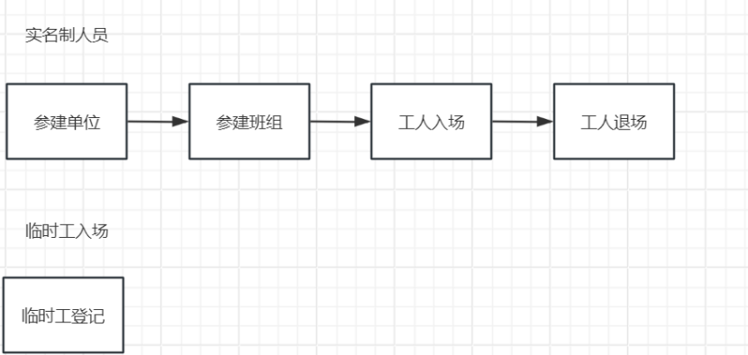

## 劳务管理

### 1. 劳务管理

#### 1.1. 参建单位
说明：参建单位是工程项目的主要实施主体，负责项目的整体规划与执行。在劳务管理方面，参建单位需要确定项目所需的劳务资源，并与参建班组建立合作关系。

#### 1.2. 参建班组
说明：参建班组是由一群具有特定技能和经验的工人组成的小团队，他们与参建单位签订劳务合同，负责具体的施工任务。参建班组在参建单位的管理下，组织工人入场、安排工作任务以及进行日常管理。参建班组是工人与参建单位之间的桥梁，确保工人的工作符合项目要求。

#### 1.3. 工人入场

说明：“*”为必填项，填写该工人所属项目即基本信息，需上传身份证正反面、工资卡、劳动合同，进场承诺书等附件。

#### 1.4. 工人变更

说明：变更类型分为变更信息（修改基础信息）和变更班组（修改班组信息）。

#### 1.5. 实名制花名册

说明：新增工人入场，提交数据后该员工数据自动录入到实名制花名册中（如新增后花名册未查询到该员工信息，可能是缓存问题），可新增、编辑、查找人员信息，若该员工退场再入场（唯一标识为身份证号码非姓名），花名册中的工作履历会显示该员工历史数据（其中蓝色字样可点击调整对应界面，可查看可编辑）。

花名册中可编辑员工状态为正常和已退场：

1. 在员工档案当修改员工状态为已退场时，工人退场通用列表无法查询到员工信息，工人退场通用列表只记录新增/修改工人退场操作记录。
2. 当修改员工状态为员工状态为正常时，工人退场可关联花名册数据。

#### 1.6. 工人退场
说明：工人退场，当月农民工工资表填报后，才可以做工人退场，否则不能填报工资表，可新增编辑工人退场，修改员工档案中的员工状态不会记录到这里。

#### 1.7. 临时工登记
说明：临时工信息不关联花名册。

#### 1.8. 信息变更

说明：区别于工人变更，可以同时修改员工基础信息、参建单位和所属班组。
#### 1.9. 考勤统计
说明：考勤统计是对工人工作时间和出勤情况的记录和统计。通过考勤统计，可以了解工人的工作状态，为工资结算、绩效考核等提供依据。

### 2.工资结算

#### 2.1. 农民工工资表
说明：填写农民工工资表之前，先把劳务基础数据导入（参建单位、参建班组、人员档案）(后期和物联网数据对接，自动更新现在导入的信息)，否则填写不了。
按照班组结算，一个班组一张单据。

“新增”打开工资表增加页面，选择项目和班组，选择结算月份，工资类型（实名制、临时工）

农民工工资表(每月15号之前上报前一个月的工资表，并在25号之前把签字视频送到数管办)

农民工工资结算表（每月20号之前结算完成）

工资明细表中，点击“导入”下载导入模板，根据模板调整格式，导入即可

农民工工资表：每月按照班组填报，一个班组一张农民工工资表；

### 2.2. 农民工工资结算表
说明：结算表用于整合项目所有班组结算月份的工资及人数，全程选择，不需要填写任何内容。

农民工工资表计算公式=（定额工资+基本工资+绩效工资+(计件工资*工作量)+（计时工资*考勤天数）+加班工资）；

农民工工资结算表：按照项目结算，每月一个项目一张农民工工资结算表，“从关联表单导入”，全选项目所有班组农民工工资表。

农民工工资支付，先选择需要支付的支付申请，选择支付的班组工资表，输入班组每个工人的实际支付工资，并上传相关支付人员的银行流水附件。

