## 施工管理

施工管理是项目管理中至关重要的环节，它通过协调资源、控制质量、进度和成本，确保项目安全、高效、按期完成，实现项目目标。

### 1.1. 开复停工

开复停工涉及的三种报告分别是：开工报告、停工报告和复工报告，它们分别用于申请开始施工、暂停施工以及恢复施工的正式文件。

#### 1.1.1. 开工报告

开工报告是项目单位向主管部门提交的，表明项目准备就绪并正式开始施工的书面报告。

注：红色框框为必填项

#### 1.1.2. 停工报告

停工报告是项目单位向主管部门提交的，说明项目因特定原因需要暂时停止施工的正式文件。
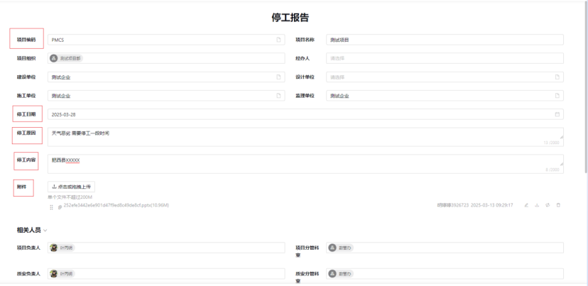

注：红色框框为必填项

#### 1.1.3. 复工报告

复工报告是项目单位在停工原因消除后，向主管部门提交的申请恢复项目施工的正式文件。
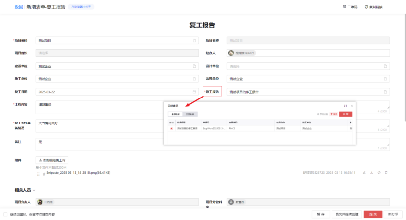

注：在提交复工报告时，“停工报告”字段里面所选的数据和停工报告相关联。

### 1.2. 形象进度

#### 1.2.1. 形象进度

在施工管理中，"形象进度"是指项目施工过程中，通过直观的方式展示项目实际完成情况的一种进度报告。它通常以图表、图片、模型等形式，形象地展示项目的施工状态。

形象进度报告的目的是为了直观地展示项目的施工进展，帮助项目管理者监控项目状态，及时发现问题，采取措施进行调整，确保项目能够按照既定计划顺利进行。通过形象进度报告，项目团队可以更好地沟通，业主和其他利益相关方也能对项目的进展有更清晰的了解。
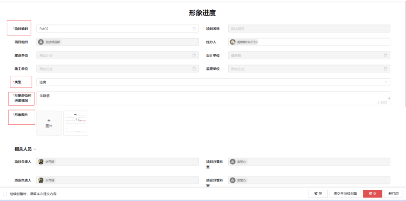

### 1.3. 施工日志

#### 1.3.1. 施工日志

施工日志是施工管理中的一项重要工作，它记录了施工过程中的日常活动、事件、问题和决策。

施工日志的主要作用包括：提供项目施工过程的详细记录，便于管理和监督；监控项目进度，确保施工活动按计划进行；记录质量控制和安全管理情况，保障施工质量和安全；作为沟通和协调的工具，促进项目团队成员之间的信息交流；为处理合同争议、索赔和审计提供依据；帮助项目经理和团队分析问题，制定决策和改进措施；保存项目历史数据，为未来的项目提供参考和经验积累。
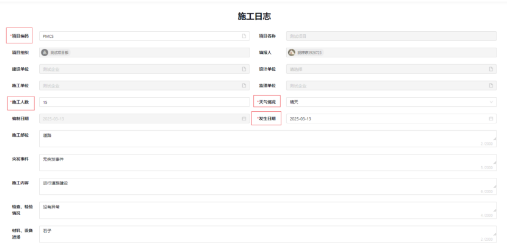

### 1.4. 监理日志

#### 1.4.1. 监理日志

监理日志是工程项目监理工作中的一项重要记录文件，它用于详细记录监理人员在项目施工过程中所观察到的情况、所执行的工作、以及所遇到的问题和采取的措施。
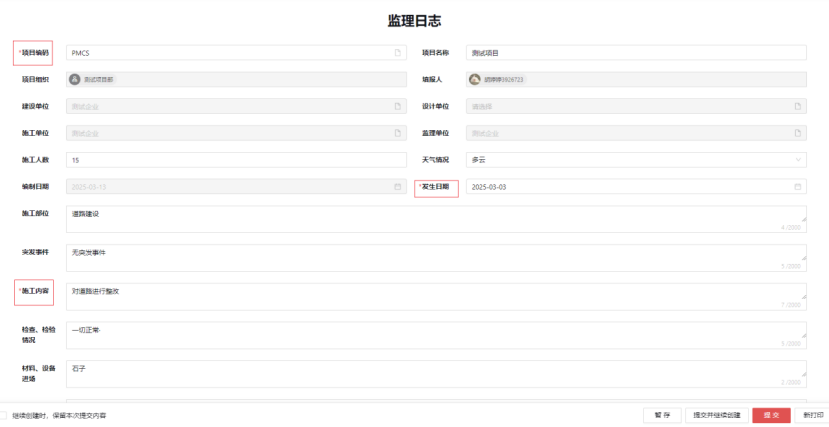

#### 1.4.2. 监理周汇报

监理周汇报是监理单位在工程项目实施过程中，按照周为单位向建设单位或其他相关方提交的关于项目进展、质量、安全、合同履行等情况的综合性报告。
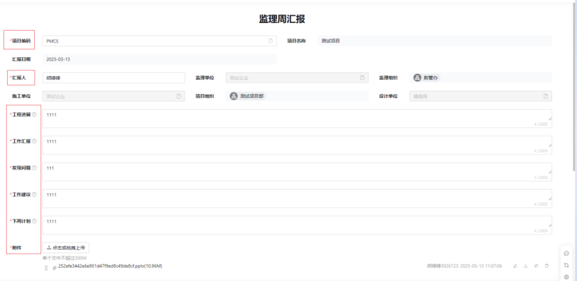

注：红色框框为必填项

### 1.5. 质量检查

说明：依据检查性质确定质量检查的范围、频率和重点。

#### 1.5.1. 质量检查单

说明：在执行质量检查过程中，检查人员使用质量检查单记录检查情况。质量检查单是质量检查的具体操作载体，它涵盖了检查项目、检查结果等内容。

在质量检查单列表里可处理作为填写申请单或整改人确认审批流程。选生成整改单，整改人审批同意后该质检单流转到整改单通用列表里。

#### 1.5.2. 质量整改单
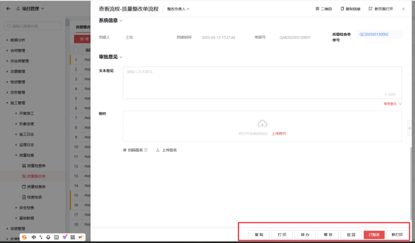

说明：检查单审批通过后，流转到整改单，在整改单处理整改审批。

#### 1.5.3. 质量检查库（如下图）

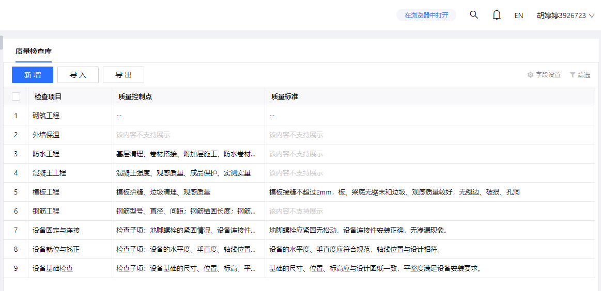

#### 1.5.4. 检查性质（如下图）

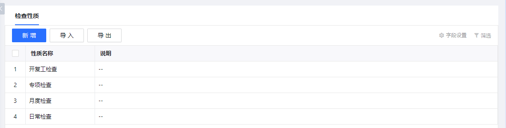
#### 1.5.5. 检查区域（如下图）

说明：可自定义检查项、检查性质、检查区域。

选生成整改单，填写申请单和整改负责人可在安全整改列表里处理单据流程。

### 1.6. 安全检查

#### 1.6.1. 安全检查
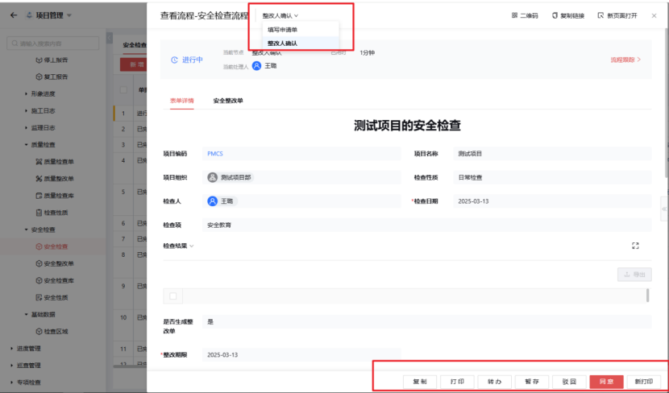

说明：在实施安全检查过程中，检查人员利用安全检查单记录检查详情。

#### 1.6.2. 安全整改单

#### 1.6.3. 安全检查库（如下图）

#### 1.6.4. 安全性质（如下图）

### 1.7. 基础数据

#### 1.7.1. 检查数据（如下图）

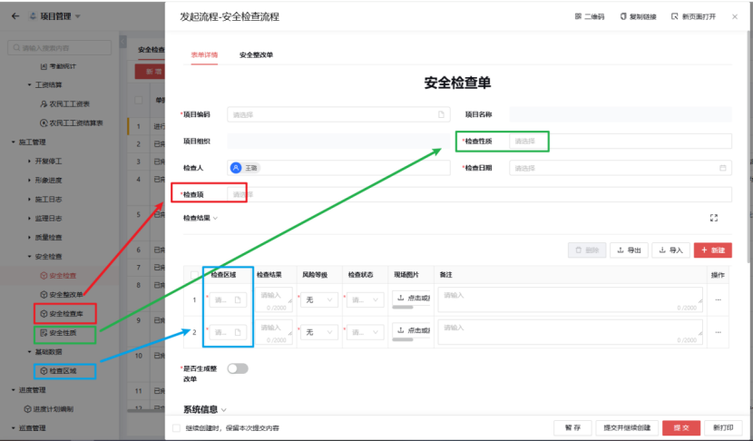

说明：可自定义检查项、安全性质、检查区域。
