# 7.施工管理

## 7.1 施工管理核心模块

### 7.1.1 开复停工管理
#### 7.1.1.1 开工报告

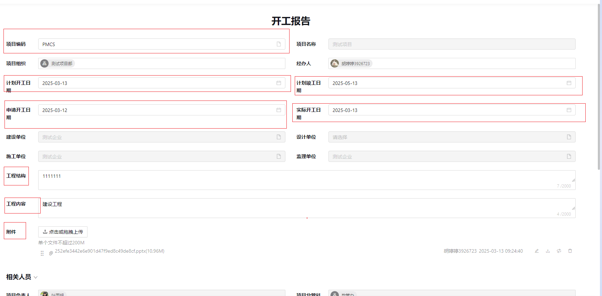

---

**功能说明**：项目正式开工的书面申请文件  
**必填字段**：*红色标注字段必须填写*

#### 7.1.1.2 停工报告  

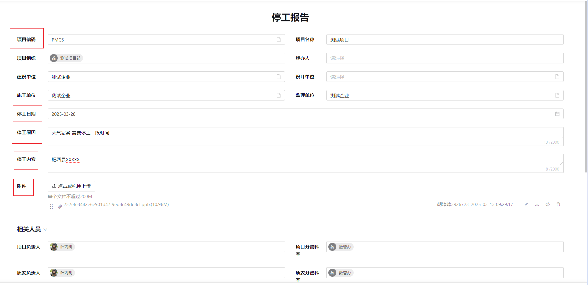

---

**功能说明**：项目暂停施工的正式申请文件  
**必填字段**：*红色标注字段必须填写*

#### 7.1.1.3 复工报告

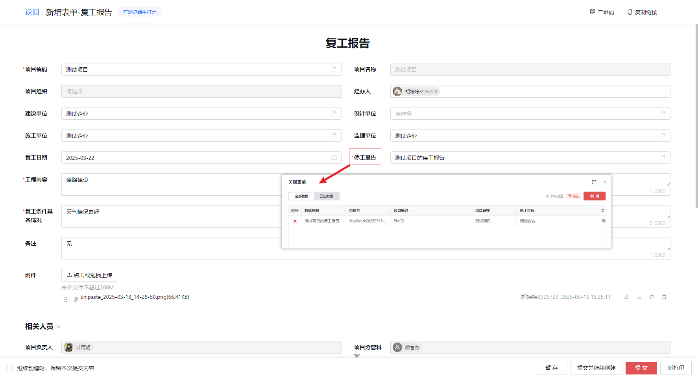

---

**功能说明**：申请恢复施工的正式文件  
**数据关联**：必须关联对应的停工报告数据

### 7.1.2 形象进度管理
#### 7.1.2.1 形象进度报告

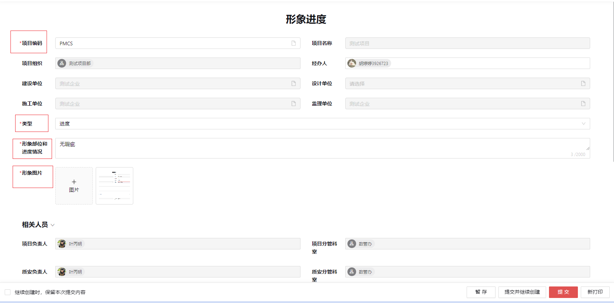

---

**核心功能**：
- 以甘特图的方式展示施工完成情况

**上报要求**：每月至少上报1次

### 7.1.3 施工日志管理
#### 7.1.3.1 施工日志

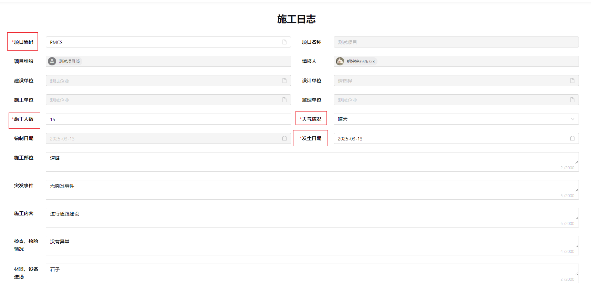

---

**记录内容**：
- 日常施工活动
- 质量安全记录
- 问题决策过程

**管理要求**：每日必须上传

### 7.1.4 监理日志
#### 7.1.4.1 监理日志

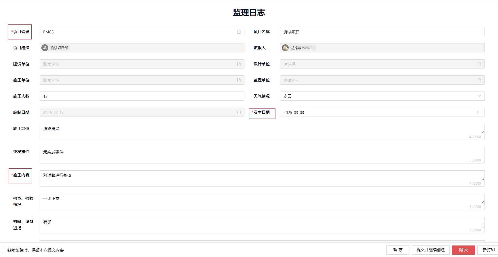

---

**记录重点**：
- 施工观察情况
- 监理工作内容
- 问题处理措施

**管理要求**：每日必须上传

#### 7.1.4.2 监理周汇报

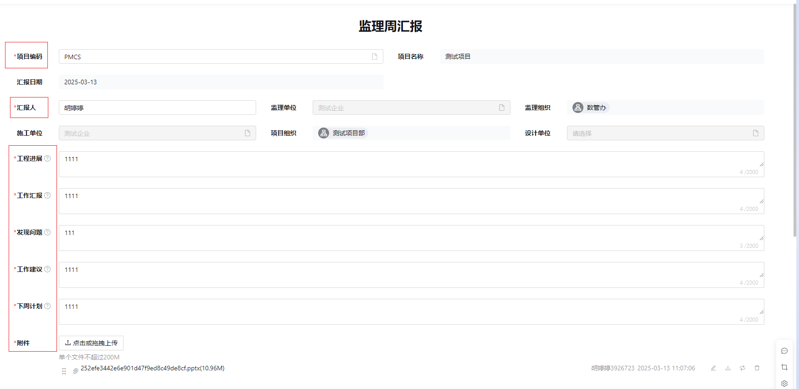

---

**报告内容**：
- 项目进展
- 质量安全情况
- 合同履行状态

**必填字段**：*红色标注字段必须填写*  
**上报周期**：每周末提交

### 7.1.5 质量检查
**检查要求**：每月不少于4次

#### 7.1.5.1 质量检查单

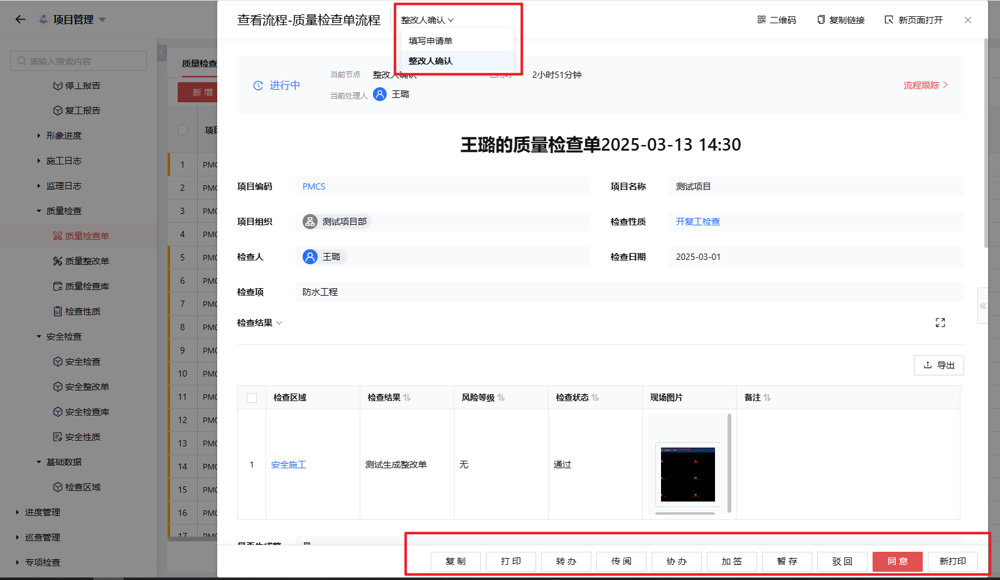

---

**检查状态**：
1. 通过
2. 口头警告
3. 书面整改（必须生成整改单）

**流程说明**：整改人→施工方质量负责人

#### 7.1.5.2 质量整改单

---

**功能定位**：检查单审批通过后的整改流程载体

#### 7.1.5.3-5 基础数据

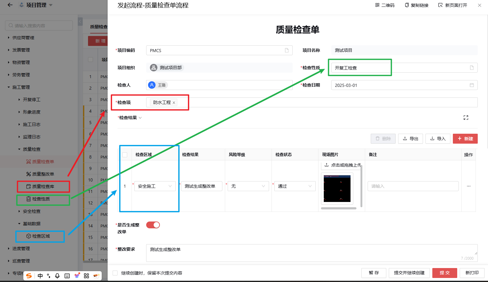  

---

**自定义配置**：
- 检查项
- 检查性质  
- 检查区域

### 7.1.6 安全检查  
**检查要求**：每月不少于4次

#### 7.1.6.1 安全检查单

---

**检查状态**：
1. 通过
2. 口头警告  
3. 书面整改（必须生成整改单）

**责任人员**：施工方安全负责人

#### 7.1.6.2 安全整改单

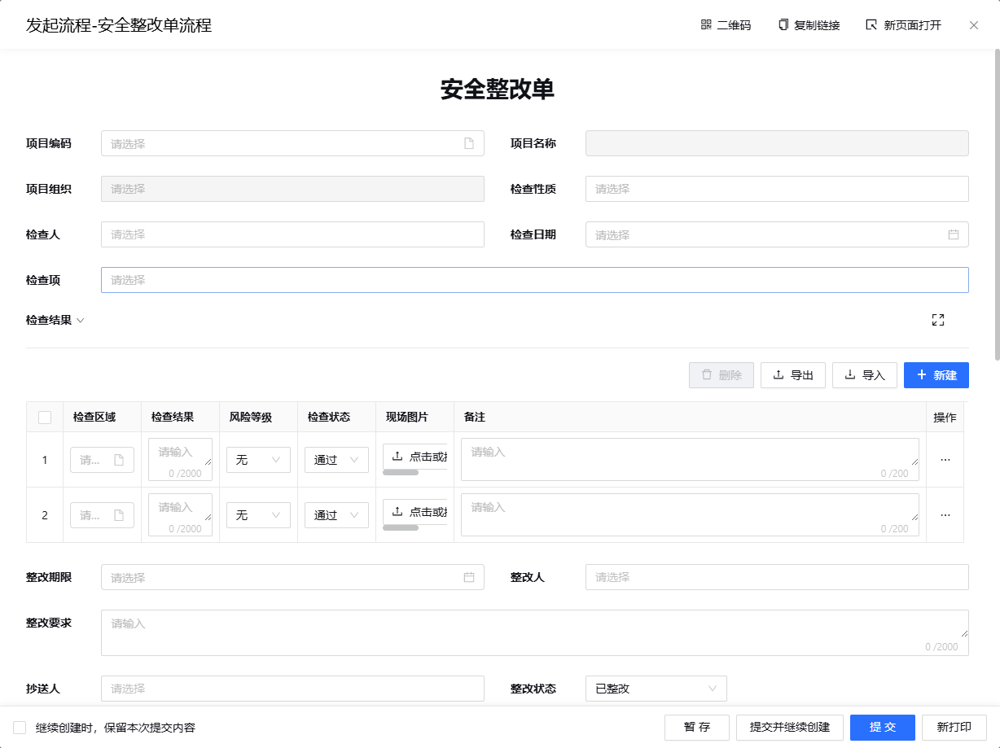

---

**整改要求**：
- 限期整改
- 提交整改证明图片
- 附详细说明

#### 7.1.6.3-4 基础数据

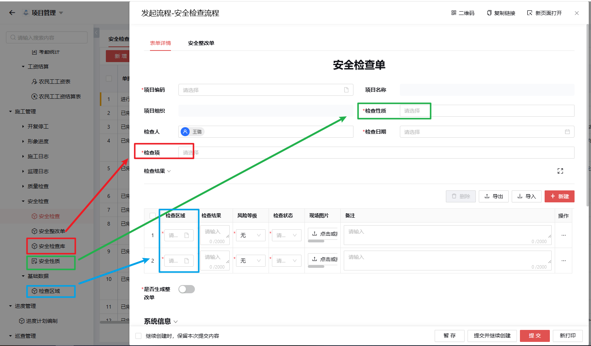 

---

**自定义配置**：
- 检查项
- 安全性质
- 检查区域

