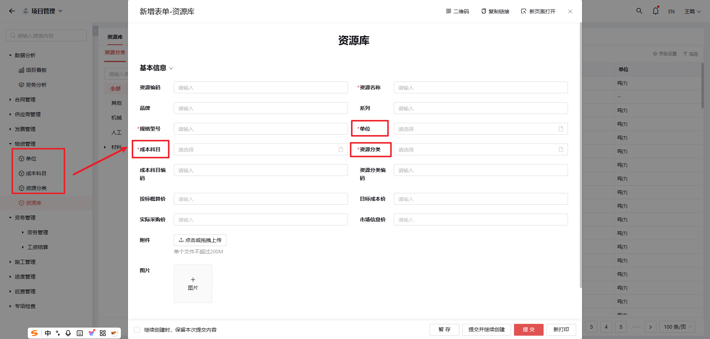
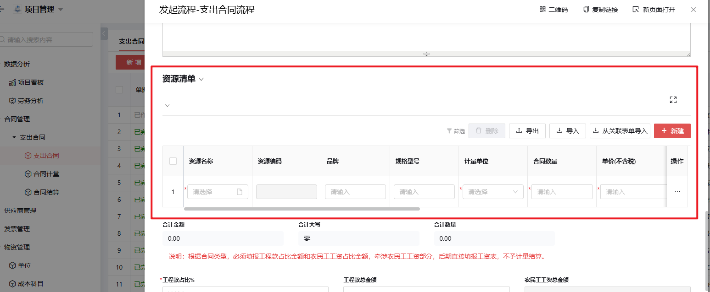

# 5.物资管理

## 5.1 单位管理
（如图5.4）

## 5.2 成本科目管理
（如图5.4）

### 功能说明
成本科目用于：
- 物资相关成本的分类
- 成本控制与分析
- 支持财务决策与报告

## 5.3 资源分类管理 
（如图5.4）

### 功能说明
资源分类主要用于：
- 区分不同种类资源
- 提高数据管理效率

## 5.4 资源库管理

---

### 核心功能
- 集中存储物资信息
- 分类管理各类资源
- 确保资源有效调配
- 实现资源高效利用

### 数据关联
- 部分数据来源于物资管理自定义配置
- 作为支出合同流程的资源清单数据源