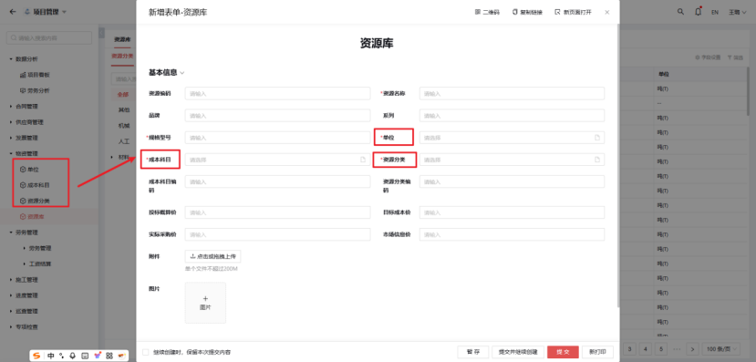
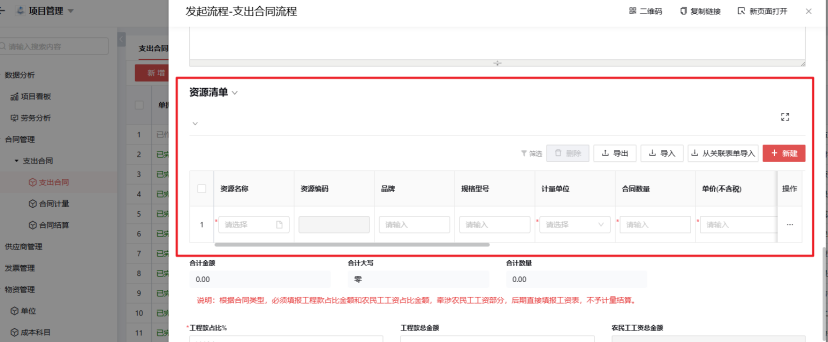

## 物资管理

### 1. 单位

### 2. 成本科目

说明：成本科目在物资管理中用于分类、控制和分析物资相关成本，以支持财务决策和报告。

### 3. 资源分类

说明：资源分类主要用来区别资源的不同种类，以提高数据管理效率。

### 4. 资源库

说明：资源库在物资管理单位中起到集中存储、分类管理各类物资信息，确保资源有效调配和高效利用的核心作用。个别数据来源于物资管理自定义配置，是支出合同流程中的资源清单数据来源。

