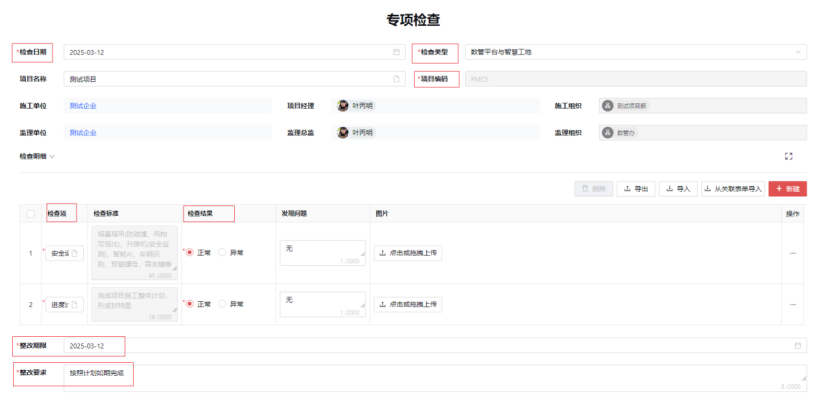
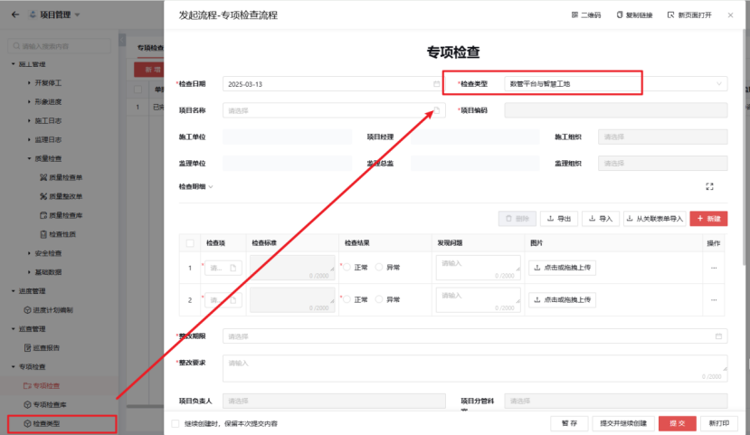

## 专项检查

说明：在项目管理中，专项检查是指针对项目的特定方面或环节进行的详细检查，以确保项目符合规定的标准、流程和要求。

### 1. 专项检查

专项检查是指针对某一特定领域、问题或风险进行的集中、详细的检查活动。它通常由相关管理部门或专业机构组织实施，目的是发现潜在的问题，评估风险程度，确保规定和标准的遵守，促进整改和提高管理水平。

注:红色*字段为不可缺少项

### 2. 专项检查库

专项检查库是一个用于管理和存储专项检查相关信息的系统或数据库。它通常包含以下关键信息：

**检查名称（Inspection Name）**：描述了专项检查的具体名称或标题，以便于识别和区分不同的检查活动。例如：“质量检查”、“环境监测”等。

**检查类型（Inspection Type）**：根据检查的目的和内容进行分类，反映了检查的性质和范围。常见的检查类型包括但不限于：质量检查、安全检查、环境保护检查、合规性检查、工艺流程检查等。

**检查标准（Inspection Standards）**：指定了进行专项检查时应遵循的具体标准或规范。这些标准可能来自行业标准、地方规定、企业内部管理规定或项目特定的要求。

### 3. 专项检查类型

说明：自定义检查类型。
