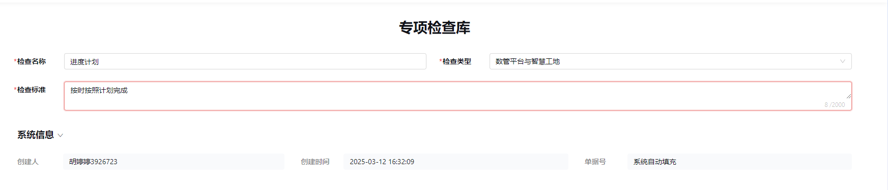
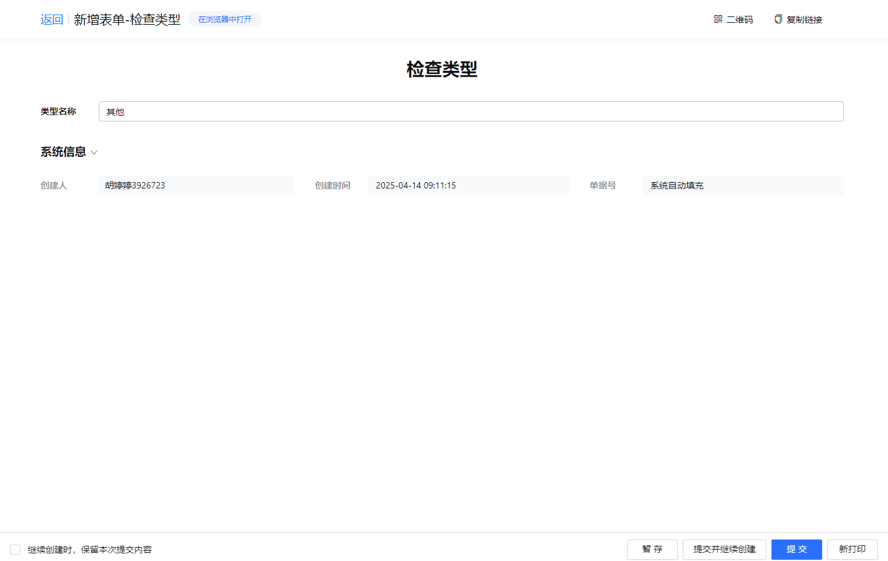

# 10.专项检查

## 10.1 专项检查

### 功能说明
专项检查是针对项目特定方面进行的深度检查，确保符合：
- 行业标准
- 管理流程  
- 项目要求

### 检查特点
1. **针对性**：聚焦特定领域/问题/风险
2. **专业性**：由管理部门或专业机构实施
3. **目的性**：
   - 发现问题隐患
   - 评估风险等级
   - 确保合规性
   - 推动整改提升

### 填写要求
*红色标注字段为必填项*

## 10.2 专项检查库

---

### 系统功能
- 集中管理检查信息
- 标准化检查要素配置
- 支持以下信息维护：
  - 检查名称
  - 检查类型
  - 检查标准

## 10.3 专项检查类型

---

### 管理方式
- 开放类型自定义功能
- 自动保存新增类型
- 类型名称自由定义