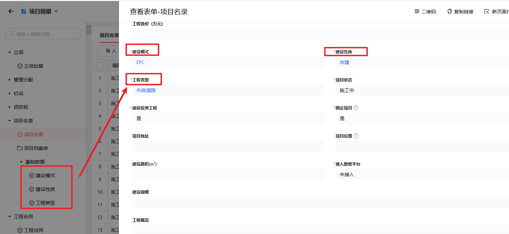

# 第五章 项目前期

## 1. 项目名录

### 1.1 项目名录

**说明**：

1. **基本信息**  
   记录项目核心信息：
   - 项目名称
   - 项目编号  
   - 项目类别
   - 项目概述
   - 项目目标
   - 预期成果
   - 开始日期
   - 结束日期

2. **中心分管**  
   明确项目管理责任：
   - 责任管理部门
   - 分管领导
   - 具体管理人员

3. **其他人员**  
   项目相关人员清单：
   - 项目团队成员
   - 合作伙伴

4. **八大员**  
   关键岗位配置：
   - 项目经理
   - 技术负责人  
   - 施工员
   - 质量员
   - 安全员
   - 材料员  
   - 资料员
   - 机械员

5. **项目资金情况**  
   财务监控信息：
   - 预算总额
   - 已分配资金
   - 资金使用情况  
   - 资金余额

6. **项目资金申报情况**  
   资金管理流程：
   - 申报流程
   - 审批状态
   - 资金到位情况

**附**：项目附件目录

---

### 1.2 项目档案库

**说明**：项目文档中央存储库

---

### 1.3 基础数据

#### 1.3.1 建设模式

**说明**：项目建设的组织模式  
- EPC  
- 总承包  
- PPP（公私合作）  
- 其他模式

#### 1.3.2 建设性质

**说明**：项目性质分类  
- 新建  
- 改建  
- 扩建  
- 维修  
- 其他

#### 1.3.3 工程类型

**说明**：项目工程类别  
- 房屋建筑  
- 道路桥梁  
- 水利设施  
- 园林绿化  
- 其他类型