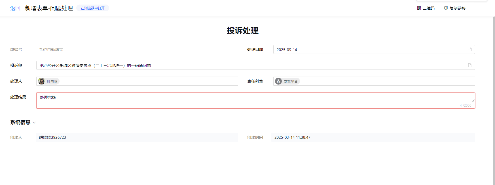

## 2. 处理问题

---

### 功能说明
- **投诉处理系统**：专门用于投诉问题处理
- **核心字段**：
  - 处理日期选择
  - 关联投诉单（绑定反映问题表单）
  - 处理人
  - 责任科室
  - 处理结果详细描述

### 操作功能
- 暂存处理记录
- 提交处理结果
- 其他操作选项

### 业务流程
反映问题（记录） → 处理问题（解决） → 结果确认（闭环）

### 管理目标
- 完整记录处理过程
- 实现问题跟踪闭环
- 确保问题妥善解决