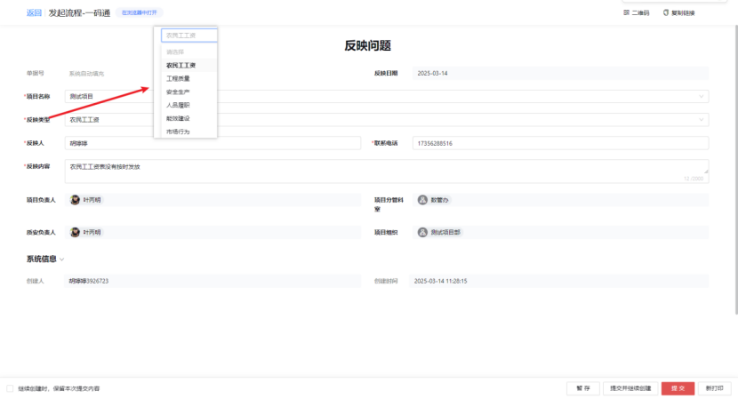

# 第八章 一码通

## 1. 反映问题

---

### 功能说明
- **问题记录平台**：用于提交项目中的各类问题
- **字段类型**：
  - 必填字段（*标注）
  - 可选字段
- **操作功能**：
  - 暂存草稿
  - 正式提交
  - 其他操作按钮

### 反映类型选项
1. 农民工工资问题
2. 工程质量问题
3. 安全生产问题  
4. 人员履职问题
5. 能效建设问题
6. 市场行为问题

### 管理价值
- 集中收集项目问题
- 标准化问题提交流程
- 为后续处理提供依据

