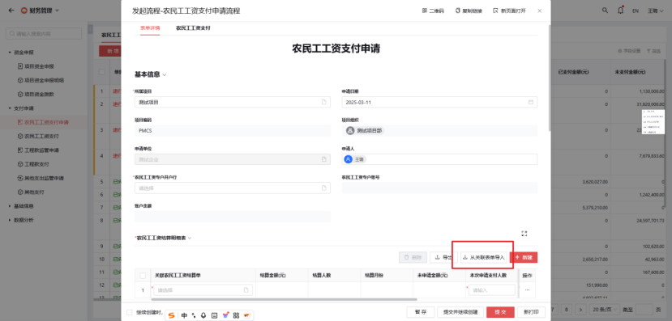
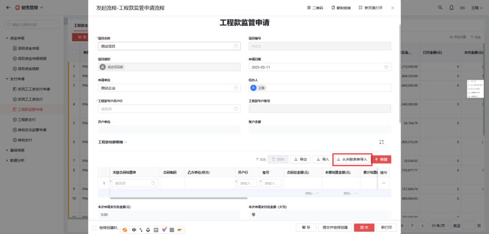
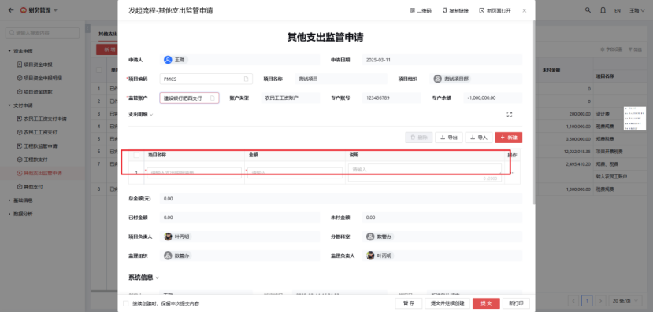

# 支付申请

## 1. 农民工工资支付申请

**说明：**

- 红色星号是必填项。
- 可以从关联表单导入多月份的结算单。
- 针对每个结算单填报支付人数和本次申请支付金额。
- 上传本次支付申请的清单附件（按照班组）。

## 2. 农民工工资支付

**说明：**

- 农民工工资支付，先选择需要支付的支付申请。
- 选择支付的班组工资表。
- 输入班组每个工人的实际支付工资。
- 上传相关支付人员的银行流水附件。

## 3. 工程款监管申请

**说明：**

- 红色星号是必填项。
- （此处可能遗漏了具体说明，请根据实际情况补充）

## 4. 其他支出监管申请

**说明：**

- 通常指的是在工程项目或企业经营过程中，除了工程款以外没有合同的其他支出的监管申请。

## 5. 其他支付

**说明：**

- 其他支付表单用于记录和管理与项目相关的其他支付事项。
- 选择关联其他支持监管申请，支付明细会自动关联并显示与其他支付监管申请相关的项目名称和申请金额。
- 用户需要手动输入本次实际支付的金额。
- 这个表单主要用于确保支付过程的透明性和合规性，同时记录支付细节以便后续审核和跟踪。
