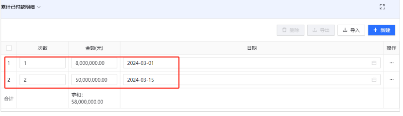

# 资金申报
## 1. 项目资金申报

### 说明
项目资金申报包括预付款、进度款、竣工结算等资金申报流程。在监管账户中增加农民工监管账户和工程款监管账户后，款项到专户后，在项目资金拨款中填报实际到账金额。
### 注意事项
- 为规范项目资金申报流程，经中心批准，数管平台的线上项目资金申报和线下纸质申报同时进行。
- 纸质申报材料送往中心时，线上流程必须已经发起。
- 找相关负责人签字时，先审核线上流程，同时签署纸质的申报。
### 操作步骤
1. 点击“新增”按钮。
2. 选择所属项目。
3. 选择工程合同。
4. 填写本次申请工程款和农民工工资款项。
5. 填写以往的累计已付款明细（从关联表单导入，并删除第一行空行）。
6. 上传申请材料附件。
7. 提交。

### 备注
在项目资金申报之前，请在“项目资金申报明细”中增加以往的申请记录。

## 2. 项目资金申报明细

### 说明

项目资金申报明细模块会自动计算工程款金额和农民工工资申报金额，以便于跟踪和管理项目的资金申报情况。

## 3. 项目资金拨款

### 路径

财务管理 -> 资金申报 -> 项目资金拨款

### 说明

项目款项到达监管专户后，需要及时在此表单填报各个监管专户的收款金额。这是确保资金正确分配和透明管理的重要步骤。

### 操作步骤

1. 进入项目资金拨款表单。
2. 选择相应的监管专户。
3. 填报实际到账的收款金额。
4. 确认信息无误后提交。

### 注意事项

- 确保填报的金额与实际到账金额一致。
- 及时更新拨款信息，以反映最新的资金流动情况。
- 遵循相关的财务管理和资金申报规定。

